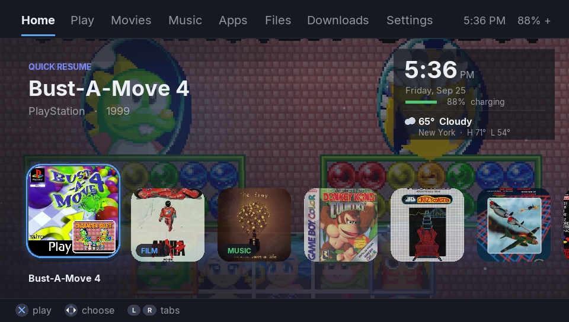
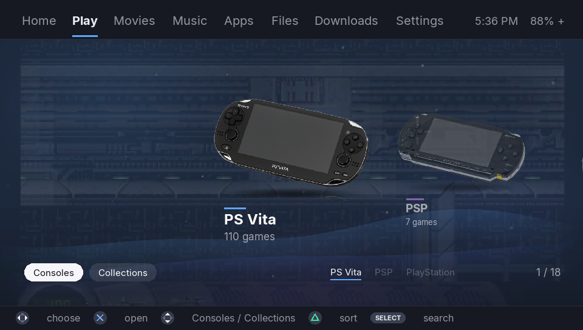
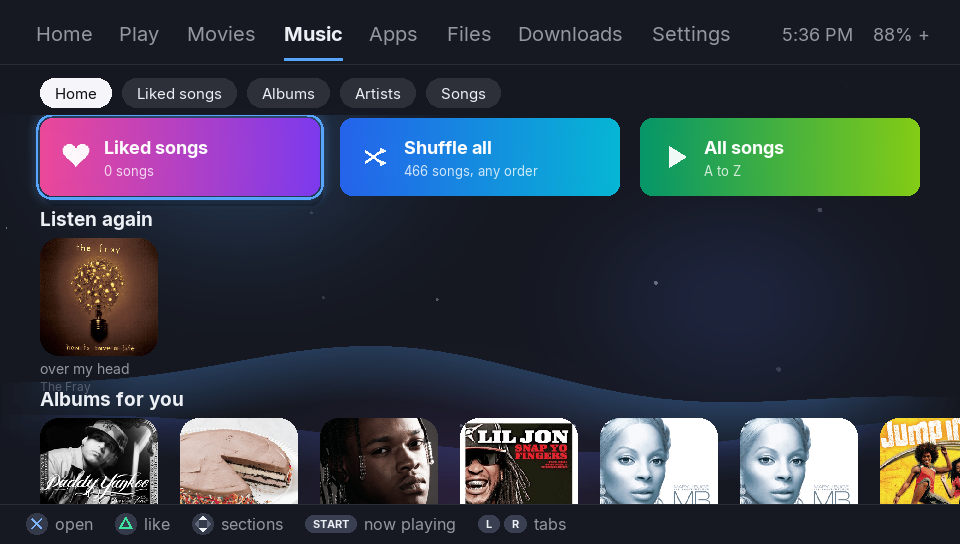
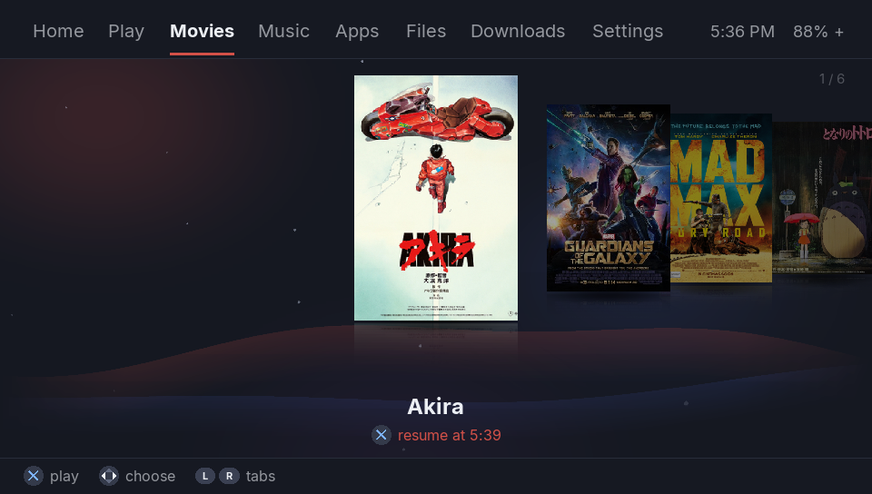
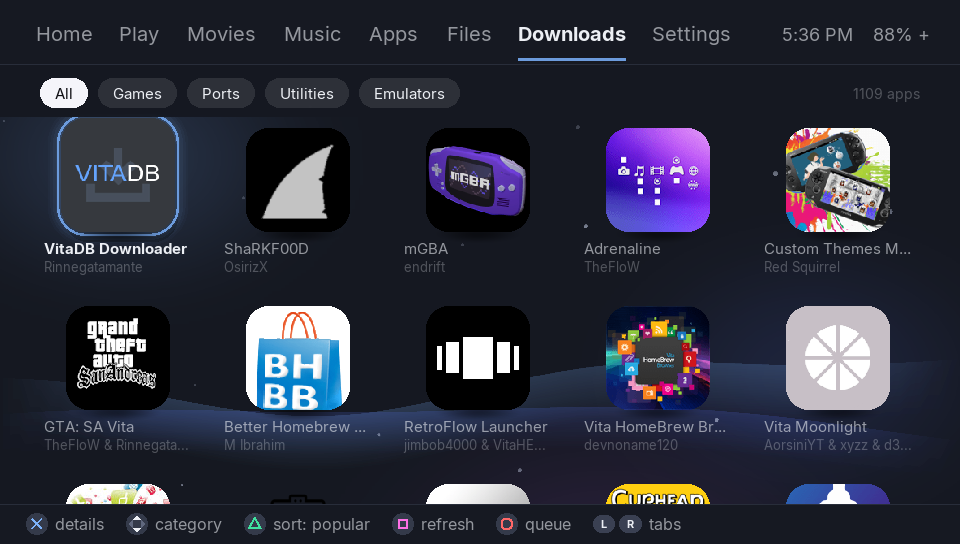

# VitaOS

A modern home screen for the PS Vita. VitaOS puts your games, films, music,
apps and photos behind one fast, good-looking menu, with a PS5-style feel on
the handheld you already own.

VitaOS is free and open source (GPLv3). It is not affiliated with or
endorsed by Sony Interactive Entertainment. PlayStation and PS Vita are
trademarks of Sony Interactive Entertainment.



| Play | Music |
| --- | --- |
|  |  |
| **Movies** | **Downloads** |
|  |  |

## What you get

- **Home:** jump back into what you played last, with Quick Resume
  snapshots, the time, battery and weather.
- **Play:** every game on your card, by console and by collection, with box
  art, gameplay previews, favourites and search. It covers RetroArch
  systems, PSP and PS Vita.
- **Movies:** a cover flow of your films with resume, plus swipe for
  brightness and volume.
- **Music:** albums, artists, songs, liked songs, shuffle and repeat, and it
  keeps playing while you browse.
- **Apps:** your installed apps as a tidy grid you can rearrange (hold X), plus
  Camera, Photos and Voice Memos built in.
- **Downloads:** a homebrew store (VitaHomebrewDB), sorted by what is most
  popular, with installs on the Vita itself.
- **Files, Settings, search,** an on-screen keyboard, toasts, UI sounds and
  a live, tilt-aware background.

## Install

You need a Vita running HENkaku or Enso, with VitaShell.

1. Download `VitaOS.vpk` from [Releases](../../releases).
2. Install it with VitaShell.
3. Open VitaOS from its bubble.

### Optional: make VitaOS feel like the Vita's own OS

With the small `vitaos_ps.suprx` plugin:

- the Vita starts in VitaOS at power-on (turn it off in Settings > VitaOS >
  Start at boot, or hold L while powering on to skip all plugins once)
- pressing PS inside VitaOS goes back to its Home tab, the way HOME works on a
  Switch
- a game you started from VitaOS brings you back to VitaOS when it ends

Without it, the Vita behaves as usual.

1. Copy `vitaos_ps.suprx` to `ur0:tai/`.
2. Add these two lines to `ur0:tai/config.txt`:
   ```
   *main
   ur0:tai/vitaos_ps.suprx
   ```
   If there is already a `*main` line, add only the second line under it.
3. Restart the Vita.

## Your content

VitaOS finds everything on the card by itself. It looks again every time it
starts.

| What | Where |
|---|---|
| Retro games | RetroArch playlists (`ux0:data/retroarch/playlists`), then ROM folders such as `ux0:data/RetroFlow/ROMS/<system>/` or `ux0:roms/<system>/` |
| Box art | RetroFlow's `COVERS` folders or RetroArch's thumbnails |
| PSP games | `ux0:pspemu/PSP/GAME` (launched through RetroFlow's Adrenaline bubble) |
| PS Vita games | Installed games, found automatically |
| Films | `.mp4` (H.264, up to 960x544) in `ux0:video/` |
| Music | `.m4a` files in `ux0:data/music/`, tagged with title, artist and album |
| Photos | Everything in `ux0:picture/` |

Retro games need [RetroArch](https://www.retroarch.com/) installed. N64 games need
DaedalusX64.

## Build from source

With [VitaSDK](https://vitasdk.org) installed:

```
mkdir build && cd build
cmake ..
make
```

This produces `VitaOS.vpk`. For the plugin, build the same way in `plugin/`.

## Credits

See [CREDITS.md](CREDITS.md).
